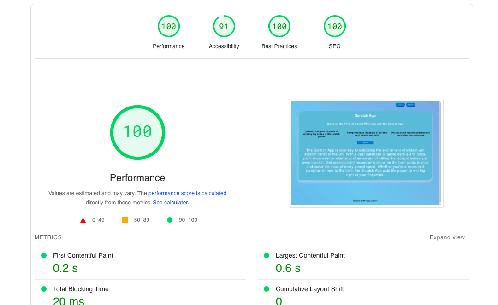
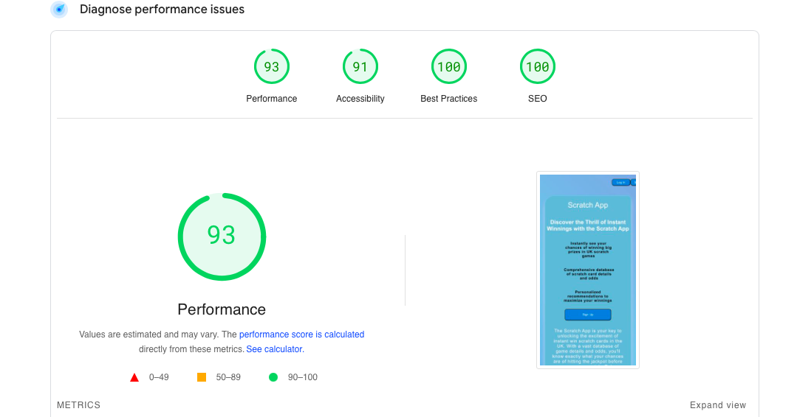

# The Scratch application 

This application is a database that stores information about winning scratch cards in the United Kingdom. Users can input their scratch card selections, and the application provides predictions on their chances of winning based on the data it has collected.

### Users should be aware that the predictions may not accurately reflect reality, as the information entered by other users could be inaccurate or unreliable.

This application was developed using the React JavaScript library and the Firebase cloud-based database platform.

## Table of content
- [Preview](#overview)
    - [Information](#the-scratch-application)
    - [Used Technology](Technology)
    - [Tools](#tools)
    - [ToDo](#todo)
    - [Links](#Links)
- [Author](#author)

## Technology

Using the React library and Firebase, I developed an application that allowed me to save user data and provide a simple login process for users.

## Tools
   

## ToDo
    Add to database scratchcards.

    landing Page:
        add style - buttons, colors, fonts,
        fix bug: log in / log out button LandingPage not change after log off from Main.

    Login: 
        add reset password
    
    Register:
        add confirm when register to app - confirm send to email
    
    Content:
        add colors to database scratchcards
        

    Setting:
        add style change - dark mode, bright mode
        set up change image
        

## Links
[live](https://main--scratchcardapp.netlify.app)

## Performance
### Deskop

### Mobile

## Author 
MikeZeg